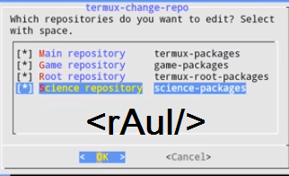

# Testando-Vulnerabilidade-Wifi 
Esse teste consiste em acessar versão redes wp2>>>>> Terminal termux>>>>>Android v7 
Vamos instalar uns programas ao inicializar>>>>>> 
$pkg updadte 
vamos limpar a tema "clear" 
termux-change-repo 
ums nova janela irá abrir, marcar todas opções  

